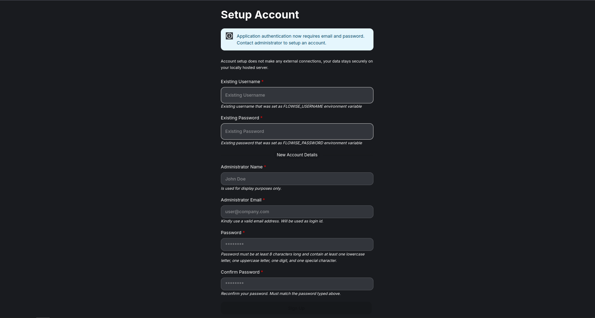
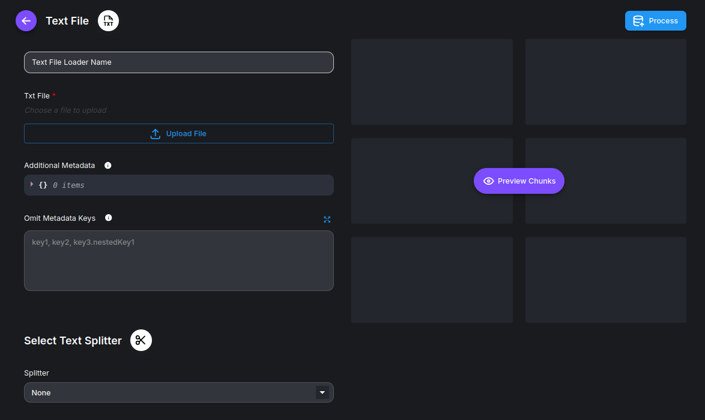
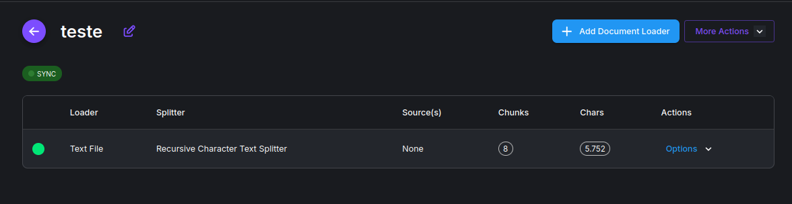
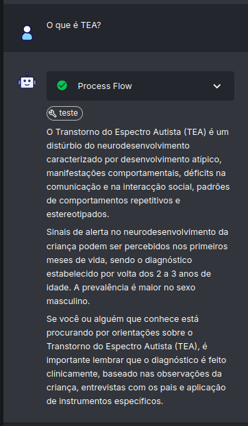

# **Flowise**

## Passo a passo para rodar

1. Crie um `docker-compose.yml`.
   1. (Vou usar o que está nesse repositório).

---

2. Suba os serviços: 
    1. No terminal, dentro da pasta:
        1. Use o comando `docker compose up -d` para rodar o docker.

---

3. Baixe os modelos no **Ollama**:
    1. Entre no container do **Ollama** digitando: `docker exec -it ollama bash`.
    2. Escolha o **modelo de linguagem** (no meu caso testei o llama3.2:3b), então dentro do container: `ollama pull llama3.2:3b`.
    3. Escolha o **modelo de embedding** (no meu caso foi o nomic-embed-text), ainda dentro do container: `ollama pull nomic-embed-text`.
    4. Dê um `exit` para sair do container.
    5. Teste rápido: `curl http://localhost:11434/api/tags`, se listar os modelos, tá tudo certo.

---

4. Verifique se os serviços estão funcionando:
    1. Acesse: **[Ollama](http://localhost:11434)**, para verificar ser o **Ollama** está funcionando.
        * Caso apareça uma página com **"Ollama is running"**, deu certo!
    2. Acesse: **[Qdrant](http://localhost:6333/dashboard)**, para verificar se o **Qdrant** está funcionando.
        * Caso apareça uma tela semelhante a essa: 
        * Deu tudo certo!
    3. Acesse: **[Flowise](http://localhost:3000)**, para verificar se o **Flowise** está funcionando.
        * Caso apareça uma tela semelhante a essa: 
        * Deu tudo certo!
            * Caso você tenha setado um **username** e uma **password** no docker, coloque eles no `Existing Username` e `Existing Password` (caso não tenha colocado, esses campos nem irão aparecer).
            * O resto das informações preencha como é pedido.

---

5. Depois de logar no **[Flowise](http://localhost:3000)**, vá até a aba **AgentFlow** e clique em **+ Add New**.
    1. Nessa nova tela você verá que existe o botão **Start**, usaremos ele logo.
    2. No canto superiror esquerdo, você verá que existe um botão de **+**.
    3. Clicando nele, você arrastará a node **Agent** para tela, do lado do **Start**.
        1. Agora é só ligar o **Start** com o **Agent**.

---

6. Agora vamos configurar nosso agente:
    1. Ao **clicar duas vezes no node** **Agent**, aparecerá uma tela com vários campos e opções, mas vamos começar pelo **modelo** **`Model`**.
    2. Selecione o modelo que você estiver usando, no meu caso é o `ChatOllama`.
    3. Depois de selecionar o modelo aparecerá uma nova opção abaixo dele, `ChatOllama Parameters`.
        1. Dentro dos parâmetros, já que estamos usando o docker, mudamos o `Base URL` para `http://ollama:11434`.
        2. Em `Model Name`, colocamos `llama3.2:3b`.
        3. Já a temperatura, `Temperature`, depende do que você prefere para seu agente.
            * Explicando rapidamente, quanto maior **temperatura**, mais **"criatividade"** o agente vai ter, mas com isso ele pode acabar inventando informações.
            * Eu recomendaria um **0.3** ou **0.4** normalmente.
        4. Os parâmetros `Top P` e `Top K` também trabalham nessa ideia de criatividade ou conservadorismo, mas não mexi neles.
    4. Podemos testar ele clicando no **ícone** de **chat** no canto superior direito da aba, caso ele responda algo, deu certo!

---

7. Volte para a tela inicial do **Flowise**, e vá para a aba **Document Store** para aplicar o **<ins>RAG</ins>**.
    1. Clique em **+ Add New** e dê um nome para esse armazenamento de documentos.
    2. Entrando nesse armazenamento clicamos em **+ Add Document Loader**. 
        1. Agora selecione o **Document Loader** específico do tipo de arquivo que você quer utilizar.
        2. Exemplo, para um .txt, pegue o Loader `Text File`.
        3. Você entrará em uma tela semelhante a essa: 
            * Pode dar um nome caso queira (mas não é obrigatório).
            * No `Upload File` você coloca o arquivo que será salvo.
            * E no campo `Select Text Splitter` depende que tipo de arquivo você está utilizando, mas para .txt e .pdf o recomendado é usar o `Recursive Character Text Splitter`.
                * E dentro do `Recursive Character Text Splitter`, existem campos como `Chunk Size` e `Chunk Overlap`, que seriam respectivamente, o tamanho das chunks que serão salvas (em caracteres, que por padrão é 1000) e a quantidade de caracteres que serão sobrepostos entre as chunks (no caso os caracteres que irão repetir para dar contexto).
            * Pode clicar em **Preview Chunks** para ter uma noção de como estão os chunks.
            * Por último clique em **Process** para salvar essa separação de chunks do arquivo escolhido.
    3. Você verá algo como: 

---

8. Agora volte para o **[Qdrant](http://localhost:6333/dashboard)**!  
    1. Em qualquer uma das abas é possível ver que no canto superior direito tem uma chave (🔑) com o nome de **API Key**.      
        1. Clique nela, dê um **nome para sua chave** e por fim dê um `Apply`.
            * Precisamos dessa chave para conectar o **Qdrant** no **Flowise**, 
    2. Indo para a aba **Collections** clique em **+ Create Collection**. 
        1. Dê um nome para a coleção e clique em **Continue**.
        2. Na pergunta **What's your use case?** Clique em `Global Search`.
        3. Na pergunta **What to use for search?** Clique em `Simple Single embedding`.
        4. Em **Choose dimensions** escreva **768** (pois é a quantidade de dimensões que o nomic-embed-text usa)
        5. E em **Choose metric** selecione `Cosine` (pois é a mais comum).
        6. Por fim clique em **Continue** e **Finish**.

---

9.  Volte para o **Document Loader** do **Flowise**:
    1. Onde está o Loader do documento salvo, existe o campo `Actions` com um **Options** clicável, clique nele.
    2. Depois clique em `Upsert Chunks`.
        1. Onde está escrito **Select Embeddings** selecione a opção escolhida no início (no meu caso foi o embedding do **Ollama**)
            * Após selecionar o `Ollama Embeddings` é necessário mudar o `Base URL` para `http://ollama:11434`.
            * Em `Model Name`, colocamos `nomic-embed-text`.
        2. Onde está escrito **Select Vector Store** selecione o banco onde vai ser salvo o embedding dos dados (no meu caso será o **Qdrant**)
            * Após selecionar o **Qdrant** devemos criar uma credencial de conexão, então em `Connect Creditial` clique em `Create New`.
                * Aparecerá um modal que pede um **nome** e a **API key** que criamos lá no **Qdrant**.
                * Então em `Credential Name` basta dar um nome qualquer.
                * Em `Qdrant API Key` você coloca o nome que você deu para sua **chave** do **Qdrant**.
                * Ai é só clicar **Add**.
            * Em `Qdrant Server URL` coloque `http://qdrant:6333`.
            * Em `Qdrant Collection Name` coloque o nome dado para a **coleção** do **Qdrant**.
            * Por últimos confirme se o `Vector Dimension` está com `768` e o `Similarity` está como `Cosine`, igual estava no **Qdrant**.
        3. Salve essa configuração clicando em **Save Config**, então as próximas vezes que for salvar os embedding no **Qdrant**, não será preciso fazer o que foi feito acima. 
        4. Por fim clique em **Upsert** para mandar os embeddings para o **Qdrant**.
    3. Para testar se funcionou, volte ao **Qdrant** e veja se sua coleção agora têm pontos, segmentos e fragmentos diferentes de 0.
        1. Você consegue ver também como os pontos vetorias estão espalhados no banco clicando em no 3 pontos em `Actions`, depois em `Visualize` e por fim no código a direita em `Run`.

---

10. Volte para o **Agente** criado:
    1. Abrindo suas configurações novamente agora clicamos em `Knowledge (Document Stores)`
        1. Em `Document Store` haverá uma combobox que (se tudo deu certo) terá a opção do armazenamento de documentos que criamos anteriormente, então clicamos nela.
        2. Já em `Describe Knowledge` devemos descrever sobre o que é essa base de conhecimento, que é útil para IA saber quando e como procurar pela informação correta.
            * Você pode clicar na **varinha mágica** em roxo que está na altura do **Describe Knowledge** para uma IA fazer um resumo da sua base de conhecimento.
            * Mas recomendo que o **texto seja em inglês** pois as LLM's entendem melhor em inglês.

---

11.  Verificar se tudo deu certo:
     1. Abra o **chat** e pergunte algo sobre o que você o ensinou.
     2. Caso apareça o nome da base de dados que você criou e em seguida algum texto, significa que deu certo.
     3. Exemplo: 
        1.  