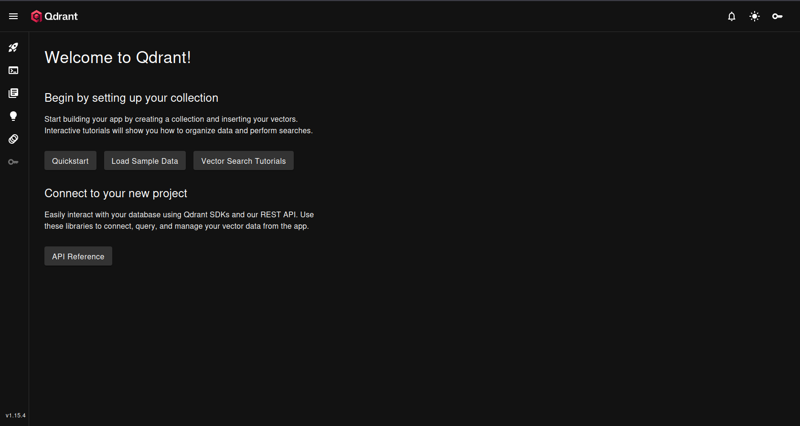
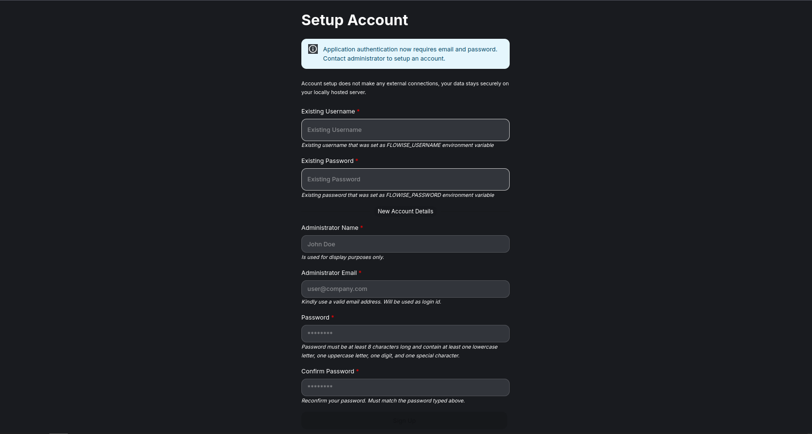

# Flowise

## Passo a passo para rodar

1. Criar um `docker-compose.yml`
2. Subir os serviços 
    1. No terminal, dentro da pasta:
        1. Use o comando `docker compose up -d` para rodar o docker.

3. Baixar os modelos no Ollama
    1. Entre no container do Ollama digitando: `docker exec -it ollama bash`.
    2. Escolha o modelo de linguagem (no meu caso testei o llama3.2:3b), então dentro do container: `ollama pull llama3.2:3b`.
    3. Escolha o modelo de embedding (no meu caso foi o nomic-embed-text), ainda dentro do container: `ollama pull nomic-embed-text`.
    4. Dar um `exit` para sair do container.
    5. Teste rápido: `curl http://localhost:11434/api/tags`, se listar os modelos, tá tudo certo.

4. Verificar se os serviços estão funcionando
    1. Acesse: [Ollama](http://localhost:11434), para verificar ser o Ollama está funcionando
        * Caso apareça "Ollama is running", deu certo!
    2. Acesse: [Qdrant](http://localhost:6333/dashboard), para verificar se o Qdrant está funcionando
        * Caso apareça uma tela semelhante a essa: 
        * Deu tudo certo!
    3. Acesse: [Flowise](http://localhost:3000), para verificar se o Flowise está funcionando
        * Caso apareça uma tela semelhante a essa: 
        * Deu tudo certo!
            * Login (se setou), exemplo: admin / admin123

5. Entrando no [Flowise](http://localhost:3000), vá até a aba **AgentFlow**
    1. Lá você verá que existe o botão ***"Start"***, usaremos ele logo.
    2. (Terminar os passos depois!)

